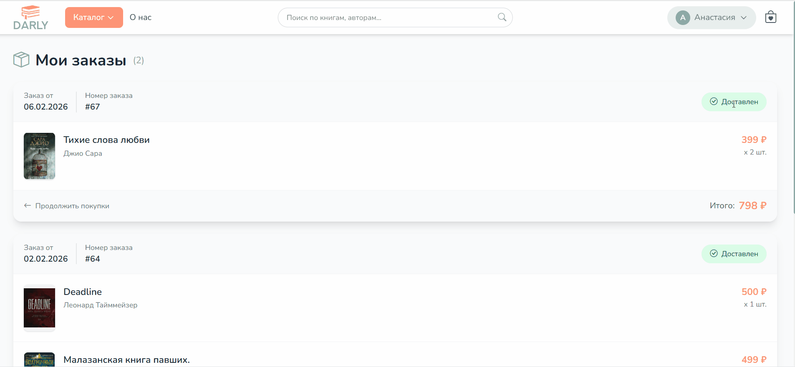
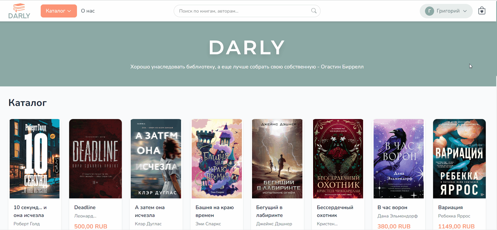

# DarlyDjango - Книжный интернет-магазин

Веб-приложение интернет-магазина книг, включающее каталог товаров с категориями и поиском, корзину покупок, оформление заказов, систему отзывов и авторизацию пользователей с ролевой моделью доступа.

---

## 🎬 Сценарии использования

### 1) Каталог и дизайн интерфейса
- просмотр каталога книг
- пагинация
- фильтрация по категориям
- поиск по названию и автору
- переход на детальную страницу товара


---

### 2) Оформление заказа и отображение в личном кабинете
- добавление книги в корзину
- изменение количества и автоматический пересчёт стоимости
- оформление заказа (требуется авторизация)
- заказ появляется в личном кабинете покупателя


---

### 3) Вход в админ-панель и управление статусом заказа
- вход в административную панель
- просмотр разделов админки
- изменение статуса заказа
- проверка обновлённого статуса в кабинете покупателя


---

### 4) Система отзывов
- отзыв доступен только после статуса заказа “доставлен”
- выставление оценки и добавление комментария
- отзыв отображается на странице товара и влияет на средний рейтинг



---

### 5) Админ-панель: добавление новой категории (доступ к БД)
- вход в административную панель
- добавление новой категории через админку (изменение данных в БД)
- проверка, что категория появилась в каталоге на сайте



---

## Стек технологий

### Backend
- Python 
- Django - веб-фреймворк
- SQLite - база данных
- django-crispy-forms - рендеринг форм
- django-vite - интеграция с Vite
- Pillow - обработка изображений
- Loguru - логирование

### Frontend
- Vite - сборщик
- Tailwind CSS - CSS-фреймворк
- PostCSS - пост-обработка CSS

---

## Установка и запуск

### Предварительные требования

- Python 3.10+
- Node.js 18+
- npm или yarn

### Первоначальная настройка

1. **Клонирование репозитория**

```bash
git clone https://github.com/Darlykn/DarlyDjango.git
cd DarlyDjango
```

2. **Создание и активация виртуального окружения**

```bash
python -m venv venv
venv\Scripts\activate        # Windows
# source venv/bin/activate   # Linux / macOS
```

3. **Установка Python-зависимостей**

```bash
pip install -r requirements.txt
```

4. **Установка frontend-зависимостей**

```bash
cd frontend
npm install
cd ..
```

5. **Применение миграций базы данных**

```bash
cd django_shop
python manage.py makemigrations
python manage.py migrate
```

6. **Создание суперпользователя**

```bash
python manage.py createsuperuser
```

### Запуск приложения

#### Локальный запуск (режим разработки)

Запустите два терминала:

**Терминал 1 -- Django-сервер:**

```bash
cd django_shop
python manage.py runserver
```

**Терминал 2 -- Vite dev-сервер (HMR):**

```bash
cd frontend
npm run dev
```

> При работе с Vite dev-сервером убедитесь, что в `settings.py` установлено `VITE_DEV_MODE = True`.

Приложение будет доступно по адресу: **http://localhost:8000**

#### Локальный запуск (без Vite dev-сервера)

Если не нужен HMR и горячая перезагрузка, можно запустить проект без Vite dev-сервера. Для этого сначала соберите фронтенд, а затем запустите Django:

1. **Сборка фронтенда**

```bash
cd frontend
npm run build
```

2. **Установите `VITE_DEV_MODE = False` в `settings.py`**

3. **Запустите Django-сервер**

```bash
cd django_shop
python manage.py runserver
```

Приложение будет доступно по адресу: **http://localhost:8000**

---

## Структура проекта

```
DarlyDjango/
|-- django_shop/                     # Основной Django-проект
|   |-- django_shop/                 # Настройки проекта
|   |   |-- settings.py              # Конфигурация Django
|   |   |-- urls.py                  # Корневая маршрутизация
|   |   |-- wsgi.py                  # WSGI-конфигурация
|   |   +-- static/                  # Статические файлы (сборка)
|   |
|   |-- shop/                        # Приложение: каталог товаров
|   |   |-- models.py                # Модели: Product, Category, Review
|   |   |-- views.py                 # Представления каталога
|   |   |-- urls.py                  # URL-маршруты магазина
|   |   |-- forms.py                 # Формы отзывов
|   |   |-- admin.py                 # Настройка админ-панели
|   |   |-- utils.py                 # DataMixin -- вспомогательный класс
|   |   |-- context_processors.py    # Контекст категорий
|   |   +-- templates/               # Шаблоны магазина
|   |
|   |-- cart/                        # Приложение: корзина покупок
|   |   |-- cart_services.py         # Логика корзины (сессии)
|   |   |-- views.py                 # Представления корзины
|   |   |-- urls.py                  # URL-маршруты корзины
|   |   |-- forms.py                 # Формы корзины
|   |   +-- context_processors.py    # Контекст итоговой суммы
|   |
|   |-- orders/                      # Приложение: заказы
|   |   |-- models.py                # Модели: Order, OrderProduct
|   |   |-- views.py                 # Представления заказов
|   |   |-- urls.py                  # URL-маршруты заказов
|   |   |-- admin.py                 # Админка с ролевым доступом
|   |   |-- forms.py                 # Форма оформления заказа
|   |   +-- signals.py               # Автообновление стоимости заказа
|   |
|   |-- users/                       # Приложение: пользователи
|   |   |-- models.py                # Модель: CustomUser
|   |   |-- views.py                 # Авторизация и регистрация
|   |   |-- urls.py                  # URL-маршруты пользователей
|   |   |-- admin.py                 # Управление пользователями
|   |   +-- forms.py                 # Формы входа и регистрации
|   |
|   |-- templates/                   # Глобальные шаблоны
|   |-- media/                       # Загруженные изображения
|   +-- manage.py                    # Скрипт управления Django
|
|-- frontend/                        # Frontend-ресурсы
|   |-- src/
|   |   |-- main.js                  # Точка входа JS
|   |   +-- main.css                 # Tailwind CSS + кастомные стили
|   |-- vite.config.js               # Конфигурация Vite
|   |-- package.json                 # Frontend-зависимости
|   +-- postcss.config.js            # Конфигурация PostCSS
|
|-- docker-compose.yml               # Docker Compose
|-- Dockerfile                       # Образ Docker
|-- requirements.txt                 # Python-зависимости
+-- README.md
```
